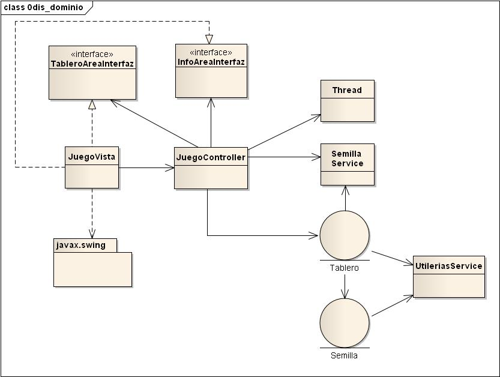
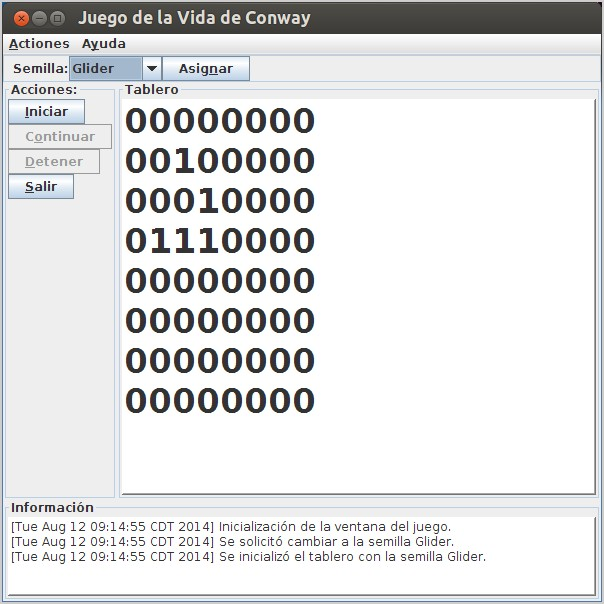

Implementación del Juego de la Vida de Conway.
==============================================
Autor:
------
    Efraín Salomón Flores

Referencias:
------------
    https://en.wikipedia.org/wiki/Conway%27s_Game_of_Life
    http://es.wikipedia.org/wiki/Juego_de_la_vida
    http://coderetreat.org/gol

Requerimientos de la Implementación
---------------------------
Información tomada de 'https://en.wikipedia.org/wiki/Conway%27s_Game_of_Life':

At each step in time, the following transitions occur:

1. Any live cell with fewer than two live neighbours dies, as if caused by under-population.
2. Any live cell with two or three live neighbours lives on to the next generation.
3. Any live cell with more than three live neighbours dies, as if by overcrowding.
4. Any dead cell with exactly three live neighbours becomes a live cell, as if by reproduction.

Scientific observers point:

1. If the sum of all nine fields is 3, the inner field state for the next generation will be life (no matter of its previous contents).
2. If the all-field sum is 4, the inner field retains its current state.
3. Every other sum sets the inner field to death.

Diseño
------
Diagrama de Clases

Para mas detalles consultar el [Documento de Disenio](docs/game_of_life_0dsn_1document.doc).

Requerimientos para la ejecución
---------------------------
    - Java 1.7
    - groovy 2.2.2

Ejecución de la Aplicación
--------------------------
    - Se cambia al directorio 'src' del proyecto:
        cd game_of_life\src

    - Se ejecuta la pantalla de inicio:
        groovy views/JuegoView.groovy

